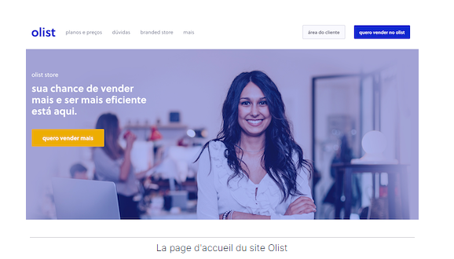

# Projet 5 - OpenClassrooms : SEGMENTEZ DES CLIENTS D'UN SITE E-COMMERCE

<u>*Auteur : Maxime SCHRODER*</u>

## Contexte

  

Olist souhaite que vous fournissiez à ses équipes d'e-commerce une segmentation des clients qu’elles pourront utiliser au quotidien pour leurs campagnes de communication.

Votre objectif est de comprendre les différents types d’utilisateurs grâce à leur comportement et à leurs données personnelles.

Vous devrez fournir à l’équipe marketing une description actionable de votre segmentation et de sa logique sous-jacente pour une utilisation optimale, ainsi qu’une proposition de contrat de maintenance basée sur une analyse de la stabilité des segments au cours du temps.

## Données
Pour cette mission, Olist vous fournit une base de données anonymisée comportant des informations sur l’historique de commandes, les produits achetés, les commentaires de satisfaction, et la localisation des clients depuis janvier 2017. Cette dernière est disponible à l'adresse suivante: https://www.kaggle.com/olistbr/brazilian-ecommerce;

## Mission 
1. Nous sommes confiants sur le fait que les données à disposition suffiront pour réaliser un premier clustering. Cela a déjà été fait par d’autres prestataires par le passé, avec encore moins de données. La segmentation proposée doit être exploitable et facile d’utilisation par notre équipe Marketing. Elle doit au minimum pouvoir différencier les bons et moins bons clients en termes de commandes et de satisfaction. Nous attendons bien sûr une segmentation sur l’ensemble des clients.

2.Une fois le modèle de segmentation choisi, nous souhaiterions  que vous nous fassiez une recommandation de fréquence à laquelle la segmentation doit être mise à jour pour rester pertinente, afin de pouvoir effectuer un devis de contrat de maintenance.

## Construction

Dans ce dépôt, vous trouverez :
1. Le notebook d'analyse exploratoire et préparation des différents features engineering : Notebook_1_exploration.ipynb
2. Le notebook des différents essais de segmentation client : Notebook_2_essais.ipynb
3. Le notebook pour la recommandation de la fréquence de maintenance: Notebook_3_simulation.ipynb
3. Le fichier contenant les différentes fonction utilisés dans les notebooks : fct_projet_5.py
4. Le support de présentation : Présentation.pdf
5. L'image de la page d'accueil de la société Olist: page_accueil_site_olist.png.
6. Les fichiers pour la mise en place de l'environnement virtuel avec poetry : pyproject.toml et poetry.lock 